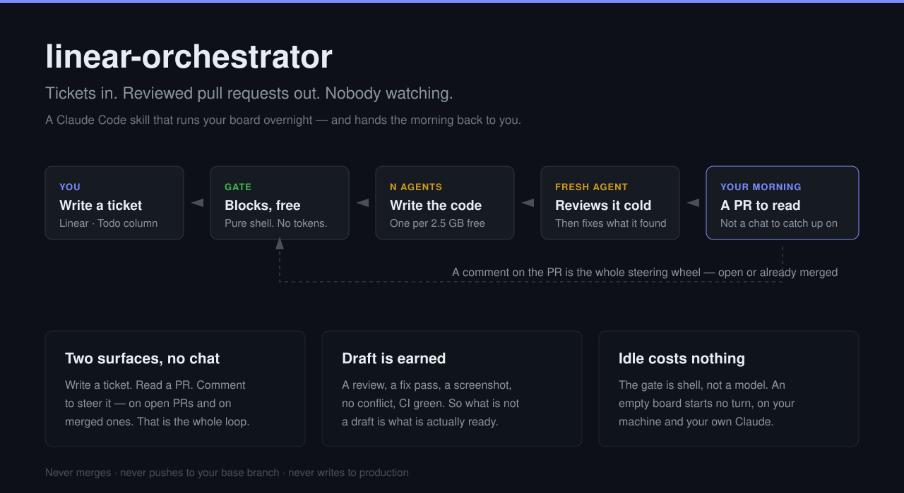

# linear-orchestrator

**Tickets in. Reviewed pull requests out. Nobody watching.**

A [Claude Code](https://claude.com/claude-code) skill that runs your Linear board
overnight and hands you a morning of pull requests to read.



## What you stop doing

**You stop talking to agents.** There is no chat window to steer, no context to
re-explain, no session to catch up on. You write a ticket in Linear and you read a
pull request in GitHub. To change the direction of the work you leave a **comment
on the PR** — and the loop reads it, answers it by name, and acts on it. That
works on a merged PR too, which is where it earns its keep: merge, note the
follow-up work the PR spotted but left out of scope, and the loop turns your note
into the next ticket by itself. No label to remember. Teammates can steer it the
same way, on purpose.

**You stop rationing the machine.** The loop measures free memory, load and disk
every minute and runs as much parallel work as the machine can actually hold —
one agent per `LO_RAM_PER_AGENT` gigabytes of real free memory, re-measured every
probe. When there is nothing to do it costs nothing at all: the gate blocks in
pure shell and wakes the model only when work exists.

**You stop reading transcripts to find the decision.** Every judgment call an
agent made, the evidence behind it and the screenshots of what changed land on the
PR — under `## Decisions`, in the review comment, in the fix-pass reply. The diff
carries its own argument, so the review is the artifact and the chat log is
nothing you need.

## What it does, in order

1. **A gate blocks until there is work** — capacity, your PRs, the Linear ready
   column. It probes every 60 seconds in pure shell, so a quiet night spends no
   tokens and starts no turns.
2. **An agent takes the ticket**, moves it to In Progress, branches, writes the
   code, tests it in a real browser, and opens a **draft** PR. Then it stops.
3. **A second agent reviews that PR in a fresh context** — it has the diff, the
   ticket and your repo's agent guide, and none of the reasoning the author talked
   itself into. It posts the review as one comment, makes exactly one fix pass over
   what it found, and corrects the PR body where the diff moved past it.
4. **The PR leaves draft only on evidence**: a review, a fix pass over it, a
   screenshot when a user can see the change, no merge conflict, and CI green on
   the head commit. Draft is therefore the honest signal — what is ready in the
   morning is what is not a draft.
5. **Your comment re-opens any of it.** An unanswered comment on one of its PRs
   outranks every other kind of work on the next tick.

It never merges, never pushes to your base branch, and never writes to
production. Two agents of the same model are still one model, so the review is
evidence about care, not proof of correctness. The morning job is to read the PRs.

## The gate — one `bash` call, no model

```
$ /linear-orchestrator
waiting for work - probe every 60s, give up after 40m
17:22Z NO - slots=1, nothing to take; no drafts; linear ready column empty
17:41Z NO - no slot: ram 2.2gb free, 2.5gb per agent, busy=1; 1 draft(s) waiting
load1=1.80 freegb=2.5 diskgb=855 busy=0 slots=1
FEEDBACK: [{"pr":768,"id":5327779919,"who":"a-teammate","state":"MERGED"}]
DRAFTS: [772]
--- woke after 26m ---
```

`gate.sh` answers "is there anything to do?" in one shot and prints either a `NO`
line **with its reason** or a compact context block. It covers capacity, reaps
leaked dev servers, re-checks the PRs it already promoted, finds comments nobody
has answered, and — the part that used to be impossible from a shell — **reads the
Linear ready column directly**, through the
[`agent-codemode`](https://github.com/janwilmake/agent-codemode) CLI.

`agent-codemode` inherits Claude Code's Linear OAuth from the Keychain, so the
gate queries Linear with **no token, no model and no cost**.

Run it as `gate.sh --wait` and it blocks until work exists, then exits — and that
exit is what wakes the model. A night with nothing to do costs zero turns instead
of one every five minutes.

## How it tells your comments from its own

Every agent posts through your own `gh`, so every comment on every PR carries
**your** GitHub login. The author field can never separate a person from a
machine. So the loop marks its own instead:

- Every comment the loop or one of its agents writes starts with `<!-- 🌙 -->`.
- An unmarked comment on a PR the loop opened is a person talking to it.
- Its reply names the comment it answers — `<!-- 🌙 ack:<comment-id> -->` — so
  "already handled" is a fact recorded on GitHub, not in a cache that a `/clear`
  can lose. Nothing is answered twice, and nothing is answered never.
- Every comment gets an answer, including the ones that need no work. Silence is
  the one wrong reply.

Set `LO_FEEDBACK_SINCE` to the day you install this. Comments older than it were
written before marking began, so they carry no marker and would all read as
instructions.

## Configure with `.env`, not the skill file

All the values that change per user live in **`.env`** beside `SKILL.md`. Copy the
template and fill it in — `.env` is gitignored, so your paths and names never
reach the repo, which is what lets the skill be a symlink to a checkout:

```bash
cp .env.example .env
$EDITOR .env
```

```bash
LO_REPO="/path/to/your/repo"   # local checkout the agents clone from
LO_BASE="dev"                  # base branch
LO_TEAM="Your Team"            # Linear team name
LO_PREFIX="ENG"                # ticket id prefix
LO_TIER1="Preferred Assignee"  # display name; unassigned is always eligible
LO_TIER2="Fallback Assignee"   # display name
LO_RAM_PER_AGENT="2.5"         # GB per agent (claude + vite + chrome)
LO_FEEDBACK_SINCE="2026-08-18T17:00:00Z"   # the day you installed this
```

Both `gate.sh` and the tick read these, so there is nothing to edit inside
`SKILL.md`.

## Read this before you run it

**Your repo must have its own agent guide.** The prompt this skill hands to each
agent is seven short paragraphs *because* the guide supplies the rest — branching,
local checks, the PR template, testing, security. Point it at a repo with no such
file and you get an unattended agent running with `--dangerously-skip-permissions`
and almost no instructions.

**The agents run unattended, with permission prompts off.** That is the point of
the skill and it is also the risk. Give the loop a repo where the worst an agent
can do is open a bad PR.

**`LO_RAM_PER_AGENT` is the number people get wrong.** It is a divisor, not just a
threshold: every tick spawns `free memory / LO_RAM_PER_AGENT` agents. The default
of 2.5 assumes one Claude session, one dev server and one Chrome. A stack that
runs Docker or a local database costs far more, and the probe cannot detect this —
set it too low and the loop over-spawns until the machine swaps. Concurrency is
bounded by real free memory, so on a small machine the loop runs one or two agents
no matter what the cap says.

> **macOS only, and Claude-only.** It drives Claude (Opus) agents through
> [`multiclaude`](https://github.com/janwilmake/multiclaude) and reads Linear
> through [`agent-codemode`](https://github.com/janwilmake/agent-codemode). It is
> not model-agnostic and not portable off macOS — the agent runner needs macOS,
> and the Linear token is read from the macOS Keychain.

## Requirements

- **macOS.** The agent runner needs `open -a Terminal` and APFS `cp -Rc`; the
  Linear OAuth token is read from the macOS Keychain.
- **[`agent-codemode`](https://github.com/janwilmake/agent-codemode)**, on `PATH`
  (or at `~/.local/node/bin/agent-codemode`). The gate uses it to read Linear.
  Without it the gate still runs, but skips the Linear check and says so.
- **`cca`**, from the
  [`multiclaude`](https://github.com/janwilmake/multiclaude) skill — it gives each
  agent its own **repo clone, Terminal window and Chrome instance**. That Chrome
  instance is the reason the work runs through `cca` and **not** Claude Code
  subagents: every agent screenshots its PR by driving a real browser, and
  subagents share the one MCP/Chrome session of their parent, so several of them
  would fight over the same tabs. `cca` isolates each agent end to end. This
  skill depends on it and does not ship it.
- **The Linear MCP server**, connected to the session that runs the loop.
- **`gh`**, authenticated, and **`jq`**.

## Install

Clone it as the skill (or clone elsewhere and symlink
`~/.claude/skills/linear-orchestrator` at it — the `.env` travels with the
directory):

```bash
git clone https://github.com/janwilmake/linear-orchestrator.git \
  ~/.claude/skills/linear-orchestrator
cd ~/.claude/skills/linear-orchestrator
cp .env.example .env && $EDITOR .env
```

Then start it from your repo — in a Claude session launched with
`--dangerously-skip-permissions`:

```bash
cd /path/to/your/repo
claude --dangerously-skip-permissions
```

```
/linear-orchestrator
```

**The `--dangerously-skip-permissions` flag is required.** The loop spawns `cca`
agents unattended overnight; without it, every `cca` call — and the git and `gh`
commands inside each agent — stops on a permission prompt that nobody is awake to
answer, and the loop stalls on the first tick. (The agents `cca` spawns already
run with it; this is about the session that runs the loop itself.)

`status` reports what is running; `stop` ends the loop and lists the PRs it
produced.
